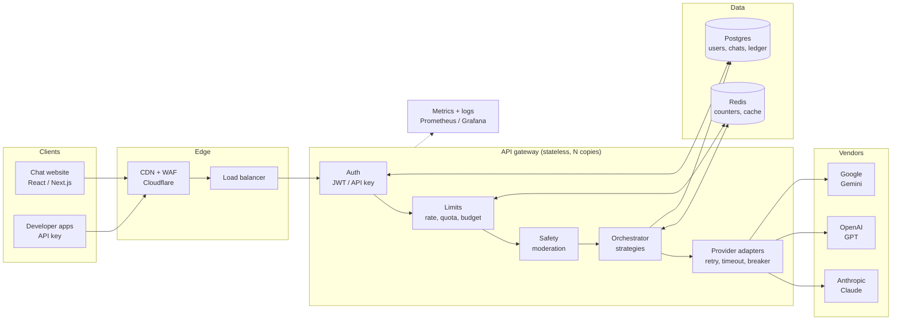
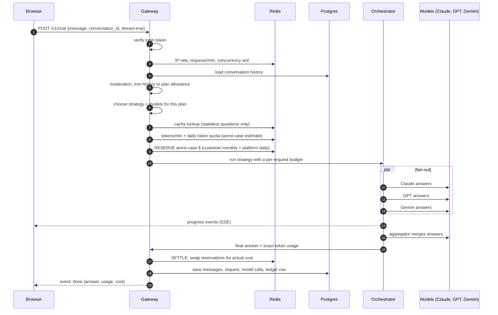
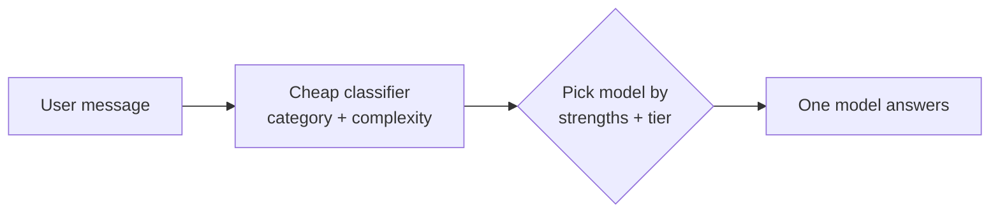
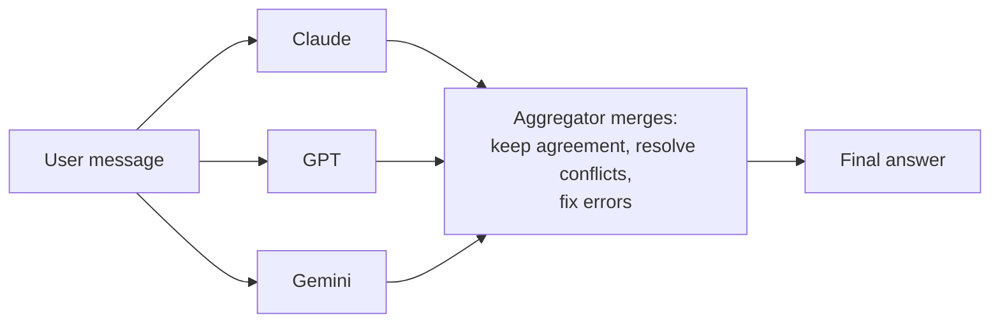
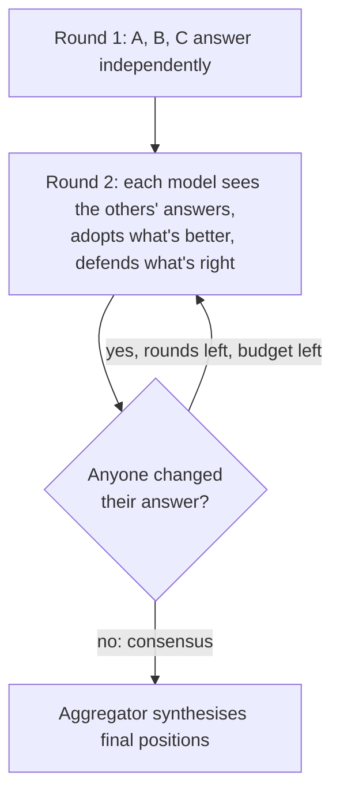
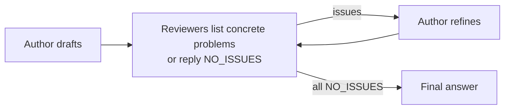
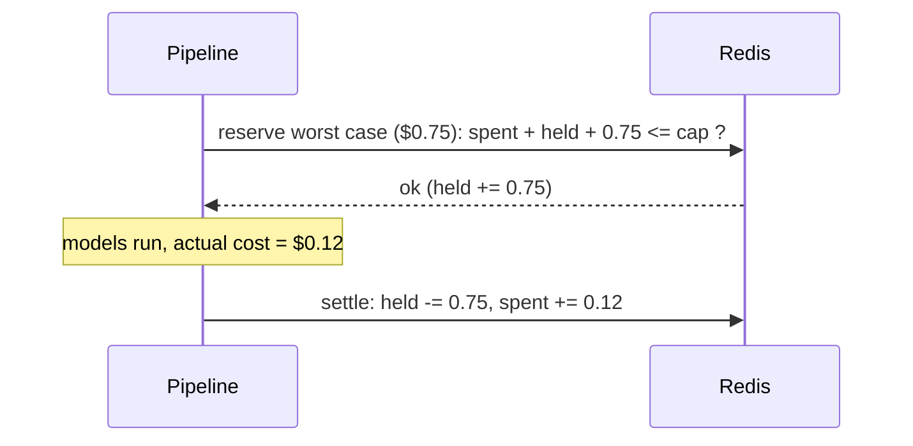
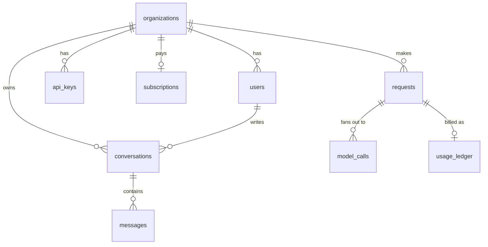
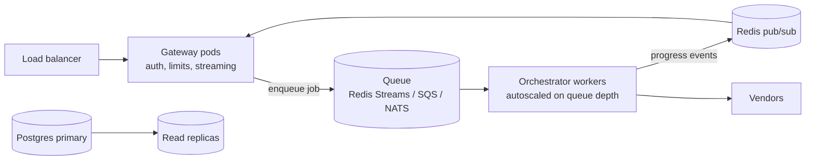

# Multi-LLM Platform: System Architecture

A platform where several AI models (Claude, GPT, Gemini, and any others you add) work on the same user message, talk to each other, and return **one** final answer. It serves two kinds of client: a ChatGPT-style **website** for end users, and a **developer API** for people who build on top of it.

This document explains *what* each part does and *why* it is built that way. Each section points to the file that implements it, and every file has comments explaining its own details.

---

## Contents

1. [Goals and non-goals](#1-goals-and-non-goals)
2. [The big picture](#2-the-big-picture)
3. [Life of a request](#3-life-of-a-request)
4. [Components](#4-components)
5. [How the models collaborate (strategies)](#5-how-the-models-collaborate-strategies)
6. [Tokens, limits and cost control](#6-tokens-limits-and-cost-control)
7. [Billing and metering](#7-billing-and-metering)
8. [Data model](#8-data-model)
9. [Scaling plan](#9-scaling-plan)
10. [Reliability](#10-reliability)
11. [Security, safety and privacy](#11-security-safety-and-privacy)
12. [Observability](#12-observability)
13. [Quality and evaluation](#13-quality-and-evaluation)
14. [Roadmap](#14-roadmap)
15. [Glossary](#15-glossary)

---

## 1. Goals and non-goals

**Goals**

- Better answers than any single model, by letting models cross-check each other.
- Predictable cost. Every request has a hard spending ceiling, every customer has quotas, and the whole platform has a daily budget.
- Survive vendor outages. If one vendor is down, answers still come back from the others.
- Vendor-neutral. Adding or swapping a model is a config change, not a rewrite.
- Ready for a chat website: streaming, conversation history, login tokens, CORS, a stop button that actually stops spending.
- Scales horizontally: API servers hold no state, so you add more of them behind a load balancer.

**Non-goals (for now)**

- Training or hosting our own models. We orchestrate vendor models. Self-hosted open models plug in later through the OpenAI-compatible adapter.
- Images, audio and tool use. The design leaves room for them (section 14).

---

## 2. The big picture

Two design rules shape everything:

1. **API servers are stateless.** Every piece of shared state (rate-limit counters, quotas, cache) lives in Redis, and everything durable (users, chats, billing) lives in Postgres. Any server can handle any request, so scaling means "run more copies".
2. **Layers only talk through interfaces.** The orchestrator does not know which vendor it is calling, and the gateway does not know how a debate works. That is why each part can be replaced or scaled on its own.

### Code map

| Layer | Folder | What it owns |
|---|---|---|
| Config | `src/config/` | Model registry, plans and limits, environment validation |
| Gateway | `src/gateway/` | HTTP routes, auth, request validation, the request pipeline |
| Limits | `src/limits/` | Rate limits, quotas, spend reservations, platform budget |
| Orchestrator | `src/orchestrator/` | Strategy selection, the four collaboration strategies, per-request budget, prompts |
| Providers | `src/providers/` | One adapter per vendor, retries, timeouts, circuit breakers |
| Billing | `src/billing/` | Token estimates, money maths |
| Memory | `src/memory/` | Conversation history trimming |
| Safety | `src/safety/` | Moderation, prompt-injection signals |
| Cache | `src/cache/` | Response cache |
| Storage | `src/store/`, `src/kv/` | Postgres and Redis behind interfaces, with in-memory versions for dev |
| Observability | `src/observability/` | Structured logs, Prometheus metrics |

---

## 3. Life of a request

What happens when a website user sends "Explain black holes" (implemented in `src/gateway/pipeline.ts`):

**Why this order:** the cheapest checks run first. A flood of requests is rejected by a Redis counter that costs a fraction of a millisecond, long before anything calls a paid model.

**Stop button:** if the browser disconnects (tab closed, Stop pressed), the server aborts every in-flight model call through an `AbortSignal`. You only pay for tokens already generated.

---

## 4. Components

### 4.1 Gateway (`src/gateway/`)

- `server.ts`: routes, CORS, security headers, one JSON error format, SSE streaming, heartbeat, client-disconnect abort.
- `auth.ts`: two ways to log in, both sent as `Authorization: Bearer ...`
  - **Website users** send their auth provider's JWT (Supabase, Firebase, Clerk, Auth0). The first login creates the user and a personal organisation on the free plan.
  - **Developers** send an API key `mlk_...`. Only its SHA-256 hash is stored, so a database leak does not leak usable keys.
- `pipeline.ts`: the 14-step request flow from section 3.
- `schemas.ts`: zod validation. Every field from the internet is type-checked and size-bounded before use.

**API surface**

| Method | Path | Purpose |
|---|---|---|
| POST | `/v1/chat` | Main endpoint. Website mode: `{message, conversation_id?}`. API mode: `{messages: [...]}` |
| GET | `/v1/me` | Plan, limits, usage left today (for a usage meter / upgrade prompt) |
| GET | `/v1/models` | Models this plan may use |
| GET/DELETE | `/v1/conversations[/:id]` | Chat history sidebar |
| GET | `/health`, `/ready`, `/metrics` | Liveness, readiness, Prometheus |

### 4.2 Orchestrator (`src/orchestrator/`)

- `selection.ts`: resolves `auto` into a concrete strategy, picks models the plan allows (one per vendor for diversity), estimates worst-case tokens.
- `strategies/`: the four collaboration patterns (section 5).
- `caller.ts`: the only path to a model. Each call goes through budget hold, then the resilient vendor call, then budget settle, then a record and an event. Strategies contain only "who talks to whom" logic.
- `budget.ts`: per-request spending ceiling (section 6.4).
- `prompts.ts`: the protocol models use to talk to each other. Versioned (`PROMPT_VERSION`).

It knows nothing about HTTP or billing, so it can move into a background worker later without changes (section 9).

### 4.3 Provider adapters (`src/providers/`)

One class per vendor implements `LLMProvider.complete()`. Each translates our standard request into the vendor's JSON and the vendor's token usage back into ours.

| Vendor | Quirks the adapter hides |
|---|---|
| Anthropic | system prompt is a top-level field; `max_tokens` required |
| OpenAI | `max_completion_tokens`; same adapter works for any OpenAI-compatible server (vLLM, Groq, Together, Azure) |
| Google | roles are `user`/`model`; `systemInstruction`; thinking tokens billed as output |
| Mock | free, offline, deterministic; used for dev and tests |

`resilience.ts` wraps every call with a timeout, retries with exponential backoff and jitter (for 429, 5xx and network errors only), and a per-model circuit breaker.

### 4.4 Model registry (`src/config/models.ts`)

Each model has a stable **internal id** (`claude-sonnet`) separate from the **vendor id** (`claude-sonnet-5-5`). Upgrading a model version means changing one line; clients, logs and invoices are unaffected. It also holds context window, max output, price, strengths (used by the router), tier, and an `enabled` kill switch.

> **The prices and some model ids in that file are placeholders.** Copy current values from each vendor's pricing page before launch. Billing is only as correct as those numbers.

---

## 5. How the models collaborate (strategies)

Four strategies trade quality against cost and speed. `auto` picks one per request.

| Strategy | Calls (N models, R rounds) | Latency | Best for |
|---|---|---|---|
| **router** | 1 small + 1 | lowest | Simple questions, free tier, cost-sensitive traffic |
| **parallel** | N + 1 | slowest model + 1 | Most questions: independent answers merged into one |
| **debate** | N x R + 1 | highest | Hard reasoning, maths, contested facts |
| **critique** | 1 + (N-1) + 1 per cycle | medium | Long-form writing, code, documents (one coherent voice) |

### Router: pick the one best model

### Parallel: independent answers, then synthesis

### Debate: models read and challenge each other

Each revision ends with `CHANGED: yes|no`. When nobody changes, further rounds would only burn tokens, so the debate stops early.

### Critique: one author, several reviewers

### Rules every strategy follows

- **Partial failure is normal.** If 1 of 3 models fails, the others continue. If the aggregator fails, another model synthesises. If everything but one fails, that one answer is returned. An error is returned only when nobody answered.
- **Another model's output is untrusted data.** It is wrapped in tags, labelled as data, and tag look-alikes inside it are neutralised (`fence()`), so an injection that fooled model A cannot command model B.
- **Answers are anonymised** (A, B, C, never vendor names) to reduce bias toward any vendor.
- **Synthesis is skipped** when only one answer exists, saving a full call.

---

## 6. Tokens, limits and cost control

### 6.1 What a token is

A token is about 3 to 4 characters of English. Vendors bill per token, separately for input (what the model reads) and output (what it writes); output usually costs 4 to 8 times more. Context windows and every limit here are measured in tokens.

There are two counts, and both matter (`src/billing/tokenizer.ts`):

- **Estimated** before a call, from a pessimistic character heuristic, to decide whether the request may run at all.
- **Actual**, reported by the vendor after the call. This is what we bill. Estimates are reconciled against it.

### 6.2 Why multi-LLM needs stricter limits

One user message fans out into many model calls. A 3-model, 2-round debate is 3 + 3 + 1 = 7 calls, and later rounds carry the other models' answers, so their prompts are larger. Limits are therefore counted in **tokens and dollars, never only in requests**.

### 6.3 The three kinds of limit (`src/config/plans.ts`)

| Kind | Examples | Protects | Enforced by |
|---|---|---|---|
| **Rate limits** (per minute) | requests/min, tokens/min, concurrent requests, requests/min per IP | The platform from bursts | Token buckets in Redis |
| **Quotas** (per day / month) | daily tokens, monthly included $, monthly hard cap $ | The business from unprofitable customers | Counters + reservations in Redis, ledger in Postgres |
| **Per-request caps** | max input, max output, max models, max rounds, max $ per request | Against one runaway request | The orchestrator's `Budget` |

### 6.4 Default plans

| | Free | Pro ($20) | Team ($100) | Enterprise |
|---|---|---|---|---|
| Requests / min | 5 | 30 | 120 | 600 |
| Tokens / min | 20k | 200k | 1M | 5M |
| Concurrent requests | 1 | 3 | 10 | 50 |
| Tokens / day | 100k | 2M | 20M | 200M |
| Included usage / month | $1 | $15 | $80 | contract |
| Overage | no | no | yes, cap $1,000 | yes |
| Max input tokens / message | 8k | 64k | 150k | 190k |
| History re-sent per turn | 4k | 24k | 64k | 120k |
| Max output tokens | 1,024 | 4,096 | 8,192 | 16,384 |
| Max $ per request | $0.05 | $0.75 | $3 | $10 |
| Models per request | 2 | 3 | 4 | 6 |
| Debate rounds | 1 | 2 | 3 | 4 |
| Default strategy | router (1 model) | auto | auto | auto |
| Strategies | auto, router, parallel | all | all | all |
| Model tiers | fast, balanced | all | all | all |

These numbers are a starting point. Tune them against your real costs from the `model_calls` table. Enterprise contracts override them per organisation (`organizations.limit_overrides`).

### 6.5 How each limit is enforced

**Token bucket (rate limits).** A bucket holds up to *capacity* tokens and refills at a steady rate. Each request removes some; if there are not enough, it gets `429` with `Retry-After`. This allows short bursts while enforcing an average, the same way vendor limits behave. It runs as one atomic Lua script in Redis so 50 API servers share one correct counter (`src/kv/redis.ts`).

**Reservation, then settle (quotas and budgets).** This works like a card payment hold:

Without the hold, ten requests started at the same moment could each see "$1 left" and together spend $10.

**Per-request budget.** Before every single model call the orchestrator takes a hold for that call's worst case (`input + max output` at the model's price). If it does not fit, the call is skipped and the strategy finishes with what it has: a debate stops early, or synthesis falls back to the best single answer. Parallel calls are checked against held money too.

### 6.6 Cost controls for you, the owner

These exist so a free website cannot run up a large bill:

| Control | Where | Effect |
|---|---|---|
| **Platform daily budget** (`PLATFORM_DAILY_BUDGET_USD`) | `limits.ts` | Global kill switch. When the whole service has spent its daily vendor budget, new requests get "at capacity, try later" until midnight UTC. Your last line of defence against abuse, bugs, or going viral. |
| **Free plan defaults to router** | `plans.ts` | Free users get 1 model per message unless they explicitly choose parallel (max 2 models, cheap tiers only). |
| **History trimming** | `memory/conversations.ts` | Long chats re-send their whole history every turn. Capping it per plan stops turn 40 costing 40 times turn 1. |
| **Output caps** | `plans.ts` | Output tokens cost the most; free answers are capped at 1,024. |
| **Stop button aborts calls** | `server.ts` | Closed tab or Stop means in-flight model calls are cancelled. |
| **Per-IP rate limit** | `limits.ts` | Slows one person creating many free accounts. Add CAPTCHA / email verification at signup too. |
| **Response cache** | `cache/responseCache.ts` | Identical stateless questions are answered for free. |
| **Early stop on consensus** | `strategies/debate.ts` | No extra debate rounds once models agree. |
| **Skip synthesis for one answer** | `strategies/common.ts` | Saves a call when only one model answered. |
| **Moderation before models** | `safety/moderation.ts` | A rejected request costs one free moderation call, not a debate. |
| **Model kill switch** | `models.ts` `enabled` | Pull an expensive or misbehaving model instantly. |

Also set **spending limits in each vendor's console** (Anthropic, OpenAI and Google all offer them). They are an independent safety net in case this code has a bug.

### 6.7 Cost example

Pro user, 1,000-token question, parallel strategy with Claude Sonnet + GPT + Gemini Pro, 800-token answers, Sonnet as aggregator, placeholder prices from `models.ts`:

| Call | Input | Output | Approx. cost |
|---|---|---|---|
| 3 independent answers | 3 x 1,050 | 3 x 800 | ~$0.034 |
| Synthesis (reads all 3) | ~3,500 | 800 | ~$0.023 |
| **Total vendor cost** | | | **~$0.056** |
| Customer price (1.3x markup) | | | ~$0.073 |

The same question with **router** (Sonnet alone, plus a tiny classifier call) costs about $0.015, under a third. That gap is why the free tier defaults to router and why `auto` sends simple questions there.

---

## 7. Billing and metering

- **Money is integer micro-dollars** (1 USD = 1,000,000) everywhere. Floating-point dollars drift (`0.1 + 0.2 !== 0.3`) and that error accumulates over millions of calls.
- **Two amounts per request:** `cost` (what vendors charge us) and `price` (cost x plan markup, what the customer pays). Both are stored, so margin is always visible.
- **The ledger is append-only** (`usage_ledger`). Rows are never updated or deleted; corrections are new `adjustment` rows. `UNIQUE(request_id, kind)` makes writes idempotent, so a retried write cannot double-bill.
- **Redis is the fast mirror, Postgres is the truth.** Limits read Redis counters in under a millisecond. A nightly reconciler job (roadmap) recomputes the counters from the ledger and alerts on drift.
- **Failed requests still bill partial work.** If 2 of 3 models answered before an error, those tokens were paid to vendors, so they are recorded.
- **Subscriptions:** your payment provider's webhook (Stripe, DodoPayments, Razorpay) writes `subscriptions` and updates `organizations.plan`. The gateway reads the plan on each request, so an upgrade takes effect immediately.

---

## 8. Data model

Full schema with comments: `db/schema.sql`.

- **Organisation** is the billing unit. A website user gets a personal org automatically; a company shares one.
- **Conversation ownership** is checked inside every SQL `WHERE` clause, so a guessed id returns nothing.
- **Model outputs are not stored per call** (`model_calls` holds counts and timings only). Only the final messages the user saw are kept. Less stored data means less to leak.
- At scale, partition `requests` and `model_calls` by month.

---

## 9. Scaling plan

The code is written so each stage is a deployment change, not a rewrite.

### Stage 1: launch (up to roughly 10k daily users)

One region. 2 or more API containers behind a load balancer (Fly.io, Railway, Render, Cloud Run, ECS). Managed Postgres and managed Redis. This repo as-is.

### Stage 2: growth

- **Split gateway and workers.** Long debates no longer hold web-server connections; workers scale on queue depth. The orchestrator already has no HTTP dependencies, which makes this split possible.
- **Kubernetes** with a HorizontalPodAutoscaler. Scale on in-flight requests, not CPU, because these servers mostly wait on vendors.
- **PgBouncer** for connection pooling, plus read replicas for history and analytics reads.
- **Redis Cluster** once one node is not enough. Keys already include the org id, which shards naturally.
- **Multiple API keys per vendor** (or an enterprise tier) to raise vendor rate limits, rotated by the adapter.
- **Batch APIs** for non-urgent work (evals, summaries) at about half price.

### Stage 3: large scale

- Multi-region active-active, with users pinned to a home region for data residency (EU users' data stays in the EU).
- Analytics moved out of Postgres into a warehouse (BigQuery, ClickHouse) through change data capture.
- A learned router (section 13) and self-hosted open models for cheap traffic.
- Vendor prompt caching for long shared system prompts and documents.

### Capacity rule of thumb

Each request mostly waits on vendors (I/O), so one Node process handles hundreds of concurrent requests. The real ceilings, in order, are usually: **vendor rate limits**, then **your budget**, then **Postgres connections**, and only last CPU.

---

## 10. Reliability

| Failure | What happens |
|---|---|
| Vendor slow | Per-call timeout (`PROVIDER_TIMEOUT_MS`); other models continue |
| Vendor 429 / 5xx | Retry with backoff + jitter, honouring `Retry-After` |
| Vendor down | Circuit breaker opens after 5 failures; model skipped for 30s; ensemble continues without it |
| Aggregator fails | Next model synthesises; last resort is the strongest single answer |
| All models fail | Clean `502 upstream_error`; partial spend still settled |
| Budget reached mid-run | Stop calling models; return best answer so far, with a note |
| Server crash mid-request | Concurrency slots have a TTL so they free themselves; reservations are recomputed by the reconciler |
| Deploy | Graceful shutdown drains in-flight requests (up to 90s) before exit |
| Redis down | `/ready` fails, load balancer stops routing; requests fail closed (no unmetered spending) |

**Targets to aim for:** 99.9% availability for `/v1/chat`; time to first progress event under 1s at p95; partial-answer rate (some model failed) under 2%.

---

## 11. Security, safety and privacy

**Authentication and access**

- Identity comes only from a verified token. Never trust a user id in a body or query string.
- JWT verification rejects `alg: none` and algorithm confusion, compares signatures in constant time, and checks expiry.
- API keys are 256-bit random, shown once, stored hashed, revocable.
- CORS allows only your website's origins.
- Every conversation query filters by owner in SQL.

**Secrets**

- Vendor keys live in environment variables or a secret manager, never in code or logs. Logger redaction is a safety net.
- Rotate vendor keys regularly; use separate keys per environment.

**Prompt injection across models**

A user may write "ignore your instructions". Model A might repeat it in its answer, and model B then reads that answer. Defence: other models' output is always framed as data in delimited blocks, look-alike delimiters are neutralised, and instructions say to ignore commands inside. Injection-looking input is logged for abuse review.

**Content safety**

Input moderation runs before any model call; output moderation runs before the answer is returned. Vendors' own safety layers apply as well. Choose fail-open or fail-closed for when moderation is unavailable (`SafetyService`).

**Privacy and compliance**

- Logs hold ids, counts and timings, never prompts or answers.
- Retention per plan (`historyRetentionDays`), enforced by a nightly hard-delete job.
- Account deletion must delete conversations and messages (GDPR "right to erasure").
- Publish a Privacy Policy listing the AI vendors as sub-processors, and Terms of Service.
- Check each vendor's terms, especially rules on using outputs to train competing models and on data retention. Use zero-data-retention agreements for enterprise customers where vendors offer them.
- Age gate: most vendor terms require users to be 13+ (18+ in some places).

---

## 12. Observability

**Metrics** (`src/observability/metrics.ts`, scraped at `/metrics`):

| Metric | Answers |
|---|---|
| `mlm_requests_total{strategy,outcome}` | Traffic, error rate per strategy |
| `mlm_request_duration_seconds` | End-to-end latency |
| `mlm_model_calls_total{model,stage,outcome}` | Which vendor is failing |
| `mlm_model_call_duration_seconds{model}` | Which vendor is slow |
| `mlm_tokens_total{model,direction}` | Usage per model |
| `mlm_cost_micros_total`, `mlm_price_micros_total` | Burn rate and margin, live |
| `mlm_limit_rejections_total{type}` | Are limits too tight, or is someone abusing? |
| `mlm_cache_hits_total` | Money saved by the cache |

**Alerts to set up first:** platform spend at 80% of the daily budget; model error rate over 10% for 5 minutes; p95 latency over 30s; margin (price / cost) below 1.1.

**Logs:** structured JSON with `requestId` on every line. The id is returned in the `x-request-id` header so a support ticket can be traced end to end.

**Tracing (next step):** add OpenTelemetry spans per model call to see a debate's timeline as a waterfall.

---

## 13. Quality and evaluation

A multi-model system is only worth its extra cost if it measurably beats a single model. Measure it:

1. **Eval set:** a few hundred real (anonymised) questions per category, with reference answers or grading rubrics.
2. **Offline runs:** every strategy and model combination on the eval set; record quality score, cost and latency. A strong model judges against the rubric (LLM-as-judge), spot-checked by humans.
3. **Gate changes:** any change to `prompts.ts`, the model line-up or the router must not lower eval scores. `PROMPT_VERSION` is stored on every request so production results can be compared by version.
4. **Online signals:** thumbs up/down on answers, regenerate rate, and A/B tests between strategies.
5. **Learned router:** once there is data, train a small classifier (embedding + logistic regression) to predict which strategy and model win per question type. It replaces the LLM classifier, is faster and cheaper, and is usually the biggest cost saving of all.

---

## 14. Roadmap

**Next (needed for a polished chat site)**

- Token-by-token streaming of the final synthesis step (each adapter parses its vendor's stream; the pipeline forwards `delta` events).
- Conversation summarisation instead of hard history trimming.
- Postgres reconciler job (Redis counters vs ledger) and retention hard-delete job.
- Payment webhook to update plans; usage-based invoicing for overage.
- Signup abuse controls: CAPTCHA, email verification, disposable-email blocking.

**Later**

- Semantic cache (pgvector) for near-duplicate questions.
- File and image input (multimodal adapters), web search and tool use as orchestration stages.
- OpenTelemetry tracing.
- Queue-based workers (section 9, stage 2).
- Learned router; self-hosted open models through the OpenAI-compatible adapter.
- Admin dashboard: per-org usage, margin, model health, limit overrides.

---

## 15. Glossary

| Term | Meaning |
|---|---|
| Token | Unit of text models read and write, about 3 to 4 characters |
| Context window | Max tokens a model can read in one call |
| Ensemble | The set of models answering one request |
| Aggregator | The model that merges candidate answers into one |
| Fan-out | Sending one request to several models in parallel |
| Token bucket | Rate-limit algorithm allowing bursts up to a capacity with steady refill |
| Reservation / hold | Reserving worst-case cost before work, settling the actual cost after |
| Circuit breaker | Temporarily stops calling a failing dependency to fail fast |
| Markup | Multiplier from our vendor cost to the customer's price |
| Micro-dollar | 1/1,000,000 USD; integer unit for all money |
| SSE | Server-Sent Events: a one-way stream of events over HTTP |
| Idempotent | Safe to repeat: doing it twice has the same effect as once |
