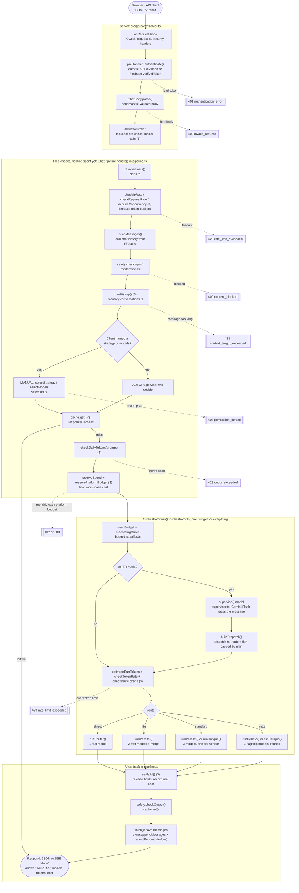
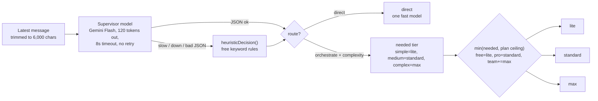
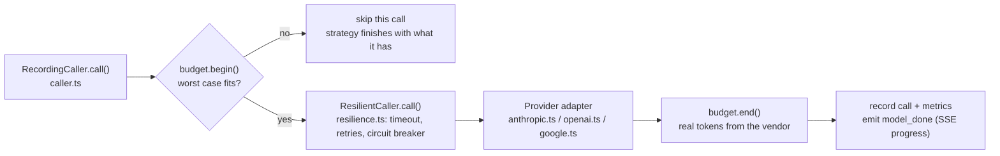

# What happens when a message comes in

Every step a message goes through, from the browser to the answer, with the file and function that does it. GitHub draws the diagrams below automatically.

Legend: **red exits** = the request is refused (HTTP status shown), **$** = a cost-control step, **model** = a paid model call.

## 1. The whole flow

## 2. How the supervisor picks a route

The plan ceiling is applied in plain code (`buildDispatch()` in `dispatch.ts`), never by the model, so a message that tries to talk the supervisor into a bigger tier cannot exceed what the plan pays for.

| Route | Models | How they collaborate | Who can reach it |
|---|---|---|---|
| direct | 1 fast model (falls back to others if it fails) | single answer | everyone, for simple messages |
| lite | 2 fast models, fast model merges | parallel, then synthesis | Free and up |
| standard | 3 models, one per vendor; balanced model merges | parallel; critique for writing and code | Pro and up |
| max | 3 flagship models; flagship model merges | debate up to 3 rounds; critique for writing | Team, Enterprise |

## 3. Inside every single model call

